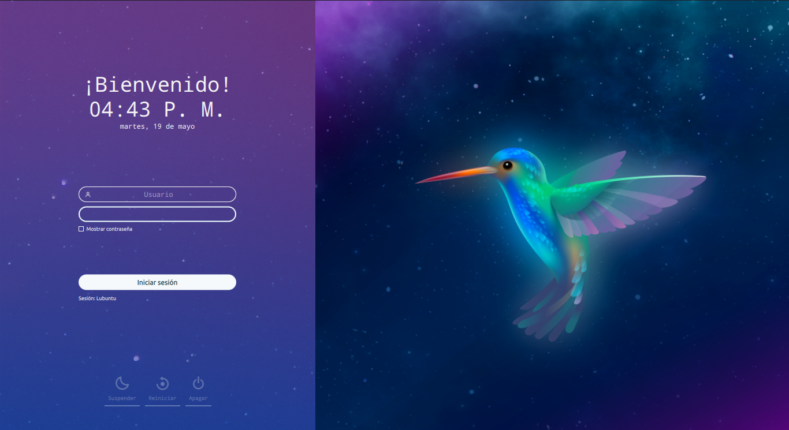

# Lubuntu-Cosmic SDDM Theme

A theme for the SDDM login manager made specifically for the Lubuntu distribution, but can also serve in any other that uses SDDM.

**Preview**

## Install

To install new themes for SDDM you must put the folder with the repository files in the address <code>/usr/share/sddm/themes</code>, after that you can select the theme you want to use by default. To do this, you can use the steps shown in the [Lubuntu official guide for SDDM configuration](https://manual.lubuntu.me/stable/3/3.1/3.1.9/sddm_configuration.html), do it with interface through **Alternatives configurator** included by default in Lubuntu 20.04 LTS or replacing the files in the folder of the default used theme (called "<i>lubuntu</i>") with those of the repository. Of course, you must make the respective backup of the original files in this folder or simply copy it to the sddm themes directory with another name.

**Note:** In other distributions such as Kubuntu, you must place the theme folder at the address mentioned above and then through KDE's aspect settings you can easily select it.

## License
